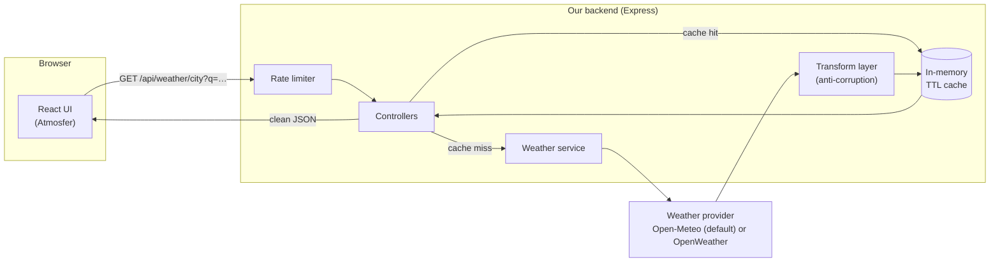

# Atmosfer — Weather Dashboard

A fast, full-stack weather dashboard built around a **backend proxy**, **response caching**, and a UI whose **sky changes to match the forecast**. Search any city (or use your location), and get current conditions, a 24-hour hourly strip, and a 7-day outlook — with the whole interface re-tinting to the real weather and time of day at that place.

> Built as a portfolio project to demonstrate third-party API integration, application state management, caching strategy, and keeping secrets off the client.

---

## Table of contents

- [Highlights](#highlights)
- [Live demo](#live-demo)
- [Architecture](#architecture)
- [Why a backend proxy?](#why-a-backend-proxy)
- [Tech stack & rationale](#tech-stack--rationale)
- [Project structure](#project-structure)
- [Getting started](#getting-started)
- [Environment variables](#environment-variables)
- [Providers (Open-Meteo, OpenWeather, demo)](#providers-open-meteo-openweather-demo)
- [API reference](#api-reference)
- [How caching works](#how-caching-works)
- [Testing](#testing)
- [Deployment](#deployment)
- [Possible extensions](#possible-extensions)
- [License](#license)

---

## Highlights

**Everything the brief asks for**

- **Smart city search** — debounced autocomplete backed by a geocoding proxy, with keyboard navigation.
- **Current conditions** — actual temp, feels-like, humidity, wind (with compass direction), UV index, pressure, visibility, dew point, sunrise/sunset, and a visual condition icon.
- **Extended forecast** — hourly for the next 24 hours and daily for the next 7 days.
- **Search history** — your last 5 locations are saved to `localStorage` and one click reloads them.
- **Clear loading & error states** — a skeleton screen while loading and a friendly, actionable panel (never a blank page) when something fails.
- **Fully responsive** — single-column, mobile-first layout; the hourly forecast scrolls horizontally instead of breaking on small screens.

**Improvisations that push it past the baseline**

- **Living sky theming** — the background gradient and accent colour are derived at runtime from the current condition code and whether it's day or night at the searched location. The entire UI eases into a new palette in one move. *The subject of the app is the changing sky, so the interface is too.* Text colour adapts to the sky's luminance (dark on bright skies, light on dark) to keep WCAG-AA contrast.
- **Light / Dark themes** — **Light** is the weather-driven living sky; **Dark** is a fixed neutral palette. Toggled from the header and persisted to `localStorage`.
- **Interactive 24-hour chart** — a dependency-free SVG graph with a Temperature / Precipitation / Wind toggle and a hover/touch tooltip that snaps to the nearest hour. Backed by a visually-hidden data table for screen readers.
- **Saved locations & comparison** — star any place to pin it, then open the **Compare** view to see all your saved cities side by side (each with a sparkline). Saved locations persist to `localStorage`.
- **Shareable deep links** — the active city and view live in the URL (`?q=Tokyo`, `?view=compare`), so any view is bookmarkable and shareable, with working back/forward.
- **Weather radar map** — an interactive Leaflet map (lazy-loaded, code-split) with OpenStreetMap tiles and a live RainViewer precipitation overlay; tap to load weather anywhere.
- **Sun arc & moon phase** — sunrise→sunset shown as an arc with the sun positioned by the time of day, plus the current moon phase — both derived locally from data already on hand.
- **Installable PWA** — a service worker precaches the app shell and keeps the last forecast available offline (NetworkFirst); add it to your home screen.
- **Animated, condition-aware UI** — a CSS particle layer rains/snows/drifts clouds/twinkles stars to match the weather, cards ease in with a staggered entrance, the hero temperature counts up, and the weather icons have subtle per-condition motion. All of it is disabled under `prefers-reduced-motion`.
- **Zero-setup, real weather out of the box** — the app defaults to **Open-Meteo**, which is free and needs **no API key**, so `npm run dev` shows live weather immediately. OpenWeather is still supported (set a key), and an offline demo mode is available via `WEATHER_PROVIDER=demo`. All three flow through the same transform layer, so the UI can't tell them apart.
- **Smart insights** — a small panel that turns the raw numbers into plain-language takeaways (umbrella timing, UV protection, wind warnings) including a **sector angle** for agriculture/outdoor work, nodding to the brief's "specialise by industry" idea.
- **Air quality, severe-weather alerts, and geolocation** — AQI with a human label, an expandable alert banner when the provider issues warnings, and a one-tap "use my location" button.
- **Backend hardening** — per-IP rate limiting, request timeouts, graceful shutdown, security headers (Helmet), gzip compression, and an anti-corruption transform layer so the frontend never sees a raw provider payload.

---

## Live demo

- **App:** _add your deployed URL here_ (e.g. Vercel)
- **API:** _add your deployed API URL here_ (e.g. Render)

A self-contained static preview (`preview.html`) is also included in the repo root — open it in any browser to see the design and interactions running on sample data, no install required.

---

## Architecture

The frontend never talks to OpenWeather directly. It only knows about our own API, which holds the key, caches responses, and normalises the data into a clean shape.



**Request lifecycle**

1. The UI calls our proxy (e.g. `GET /api/weather/city?q=Surabaya&units=metric`).
2. The rate limiter and controller validate the request and build a cache key.
3. On a **cache hit** (data younger than the TTL) the cached response is returned immediately — `X-Cache: HIT`.
4. On a **cache miss** the weather service calls OpenWeather, the **transform layer** reshapes the raw payload into our own contract, the result is cached, and it's returned — `X-Cache: MISS`.
5. The UI renders. Times are formatted in the *searched city's* timezone, and the sky re-tints to match.

---

## Why a backend proxy?

Calling a weather API straight from the browser is the most common mistake in this kind of project. The proxy exists to solve three concrete problems:

- **Secret safety.** A frontend-embedded API key is visible to anyone via DevTools and can be lifted and abused. The key lives only in the server's environment.
- **Quota protection.** Free tiers cap requests per month. Without caching, a handful of users refreshing repeatedly can burn the quota in a day. The proxy caches responses (15 min default) and rate-limits per IP, so identical requests are served from memory.
- **A stable contract.** The provider's payload is large and provider-specific. The transform layer converts it into a small, predictable shape, so the UI is decoupled from the vendor — swapping OpenWeather for another provider means changing one folder, not the whole app.

---

## Tech stack & rationale

| Layer | Choice | Why |
| --- | --- | --- |
| Backend | **Node.js + Express** | Minimal, ubiquitous, and the brief's suggested stack. Native `fetch` (Node ≥18) keeps dependencies light. |
| Caching | **In-memory TTL cache** | Zero infrastructure for a single instance and easy to reason about. The cache is wrapped behind a small interface so it can be swapped for Redis without touching callers. |
| Frontend | **React + Vite** | Fast dev server and build, component model fits a dashboard well. |
| Styling | **Tailwind CSS + CSS variables** | Utilities for speed; CSS variables drive the runtime "living sky" theming that Tailwind alone can't express. |
| Icons | **lucide-react** | Clean, consistent line icons that suit the glass aesthetic. |
| Map | **Leaflet** + OpenStreetMap + **RainViewer** | Keyless radar map, dynamically imported so it's code-split out of the main bundle. |
| Offline | **vite-plugin-pwa** (Workbox) | Installable PWA; precaches the shell and serves the last forecast offline. |
| Tests | **Vitest** + **Testing Library** | Same runner on client and server; component/hook tests run under jsdom, pure utils on node. |
| Provider | **Open-Meteo** (default) or **OpenWeather One Call 3.0** | Open-Meteo is free with no API key or quota, so the app has real weather with zero setup. Provider codes (WMO ↔ OpenWeather) and payload shapes are reconciled in the transform layer, so the client contract is identical either way. |

---

## Project structure

```
weather-dashboard/
├── server/                     # Express backend proxy
│   ├── src/
│   │   ├── routes/             # Route definitions (/api/*)
│   │   ├── controllers/        # Request validation, caching, headers
│   │   ├── services/           # weather (provider calls), cache, mock data
│   │   ├── middleware/         # rate limiter, error handler
│   │   ├── utils/              # transform (anti-corruption), time, errors
│   │   ├── app.js              # app factory (helmet, cors, compression…)
│   │   ├── config.js           # env -> typed config (derives demo mode)
│   │   └── index.js            # server bootstrap + graceful shutdown
│   ├── tests/                  # time, transform, cache unit tests
│   └── .env.example
│
├── client/                     # React + Vite frontend
│   ├── src/
│   │   ├── api/                # the single place that calls our backend
│   │   ├── hooks/              # useWeather, useSearchHistory, useGeolocation…
│   │   ├── components/         # SearchBar, CurrentWeather, forecasts, etc.
│   │   ├── utils/              # formatters, sky engine, condition mapping
│   │   ├── App.jsx             # orchestration + layout
│   │   └── index.css           # design system + living-sky variables
│   ├── tests/                  # formatter unit tests
│   └── .env.example
│
├── preview.html                # static, zero-install design preview
├── package.json                # root scripts (run both apps together)
└── README.md
```

---

## Getting started

### Prerequisites

- **Node.js ≥ 18** (for native `fetch`) and npm.

### 1. Install

From the repository root:

```bash
npm run install:all
```

This installs the root tooling and both the `server` and `client` packages.

### 2. Configure (optional for first run)

```bash
cp server/.env.example server/.env
cp client/.env.example client/.env   # optional in dev
```

You can **skip the API key entirely** to start — the server runs in demo mode (see below).

### 3. Run both apps

```bash
npm run dev
```

- Client: <http://localhost:5173>
- API: <http://localhost:5050>

In development, Vite proxies `/api` to the backend automatically, so no client env var is needed.

Run them separately if you prefer:

```bash
npm run dev:server
npm run dev:client
```

---

## Environment variables

### Server (`server/.env`)

| Variable | Default | Description |
| --- | --- | --- |
| `PORT` | `5050` | Port the proxy listens on. |
| `CORS_ORIGIN` | `http://localhost:5173` | Comma-separated allowed origins. Add your deployed frontend URL in production. |
| `WEATHER_PROVIDER` | _(auto)_ | Force a provider: `openmeteo`, `openweather`, or `demo`. Empty → auto: OpenWeather if a key is set, else **Open-Meteo (keyless)**. |
| `OPENWEATHER_API_KEY` | _(empty)_ | Your One Call 3.0 key. Optional — only needed for the OpenWeather provider. |
| `CACHE_TTL_SECONDS` | `900` | How long a weather response stays fresh (15 min). |
| `GEOCODE_CACHE_TTL_SECONDS` | `86400` | Geocoding cache lifetime (24 h — coordinates rarely change). |
| `RATE_LIMIT_WINDOW_SECONDS` | `60` | Rate-limit window length. |
| `RATE_LIMIT_MAX_REQUESTS` | `60` | Max requests per IP per window. |

### Client (`client/.env`)

| Variable | Default | Description |
| --- | --- | --- |
| `VITE_API_BASE_URL` | _(empty)_ | Leave empty in dev (Vite proxies `/api`). In production set it to your deployed API origin, **no trailing slash**. |

---

## Providers (Open-Meteo, OpenWeather, demo)

The app supports three interchangeable data sources, selected by `WEATHER_PROVIDER` (or auto-detected). Every provider is reshaped into one identical client contract by the transform layer, and each weather response carries an `X-Provider` header so you can see which one served it.

**Open-Meteo (default, recommended).** Free, no API key, no registration, no quota — so `npm run dev` shows real, live weather with zero setup. Open-Meteo speaks WMO weather codes and columnar arrays; `server/src/utils/wmoCodes.js` maps WMO codes to OpenWeather-equivalent IDs and `server/src/services/openmeteo.service.js` adapts the payload into the One Call shape before it hits the shared `normaliseWeather`. City search uses Open-Meteo's geocoding API; the GPS button's reverse lookup uses the keyless BigDataCloud endpoint; air quality comes from Open-Meteo's air-quality API (US AQI banded to the same 1–5 scale). Open-Meteo has no severe-weather alerts, so that panel is simply empty.

**OpenWeather One Call 3.0.** Optional. Bundles current + hourly + daily + UV + alerts in one request, plus Geocoding and Air Pollution endpoints. To use it:

1. Create a free account at <https://openweathermap.org/api> and subscribe to **One Call API 3.0**.
2. Put the key in `server/.env` as `OPENWEATHER_API_KEY` (the app then auto-selects OpenWeather).

**Demo mode** (`WEATHER_PROVIDER=demo`) serves realistic, internally-consistent mock data through the *same* transform and caching path, with no network calls at all. Responses include an `X-Demo-Mode: true` header and the UI shows a small, dismissible "demo mode" notice — handy for offline development.

---

## API reference

All endpoints are under `/api` and return JSON. Responses carry `X-Cache` (`HIT`/`MISS`), `X-Provider` (`openmeteo`/`openweather`/`demo`), and `X-Demo-Mode` headers.

| Method & path | Query params | Description |
| --- | --- | --- |
| `GET /api/health` | — | Service status, demo flag, and cache stats. |
| `GET /api/weather` | `lat`, `lon`, `units` | Full forecast bundle for coordinates. |
| `GET /api/weather/city` | `q`, `units` | Geocodes the city name, then returns the forecast bundle. |
| `GET /api/geocode` | `q`, `limit` | City autocomplete suggestions. |
| `GET /api/reverse` | `lat`, `lon` | Reverse-geocode coordinates to a place name. |

`units` is `metric` (default) or `imperial`. Errors return a consistent shape:

```json
{ "error": { "code": "CITY_NOT_FOUND", "message": "We couldn't find that place." } }
```

---

## How caching works

The cache is a small TTL store with a cache-aside (`wrap`) helper:

- **Weather** responses are keyed by endpoint + rounded coordinates + units and expire after `CACHE_TTL_SECONDS` (15 min default).
- **Geocoding** results are keyed by query and live for `GEOCODE_CACHE_TTL_SECONDS` (24 h).
- A background sweeper evicts expired entries, and the store is capped to a maximum size to bound memory.
- Hit/miss counts are exposed via `/api/health` so you can see the cache working.

Because the store sits behind a tiny interface (`get` / `set` / `wrap`), moving to Redis for multi-instance deployments is a drop-in change — no controller code changes.

---

## Testing

```bash
npm test            # runs server + client suites
```

Or individually:

```bash
npm --prefix server test
npm --prefix client test
```

What's covered:

- **Server** — temperature/time conversion and timezone handling, the transform/anti-corruption layer (raw payload → clean contract, including the Open-Meteo WMO-code mapping), and cache behaviour (hit/miss, expiry).
- **Client** — pure utilities (formatting, moon phase, URL state) plus component/hook tests under jsdom: the favourites hook, theme toggle, and the interactive chart (metric switching + the accessible data table).

All date/time tests pass explicit timezone and locale arguments so they're deterministic regardless of where they run.

---

## Deployment

A typical split deploy:

**API on Render (or Railway/Fly):**

1. New Web Service from the repo, root directory `server`.
2. Build: `npm install` · Start: `npm start`.
3. Set env vars: `CORS_ORIGIN` = your frontend URL. Optionally `OPENWEATHER_API_KEY` to use OpenWeather; otherwise it runs on keyless Open-Meteo.

**Client on Vercel (or Netlify):**

1. Import the repo, root directory `client`.
2. Build: `npm run build` · Output: `dist`.
3. Set `VITE_API_BASE_URL` to the deployed API origin (no trailing slash).

Then add the Vercel URL to the API's `CORS_ORIGIN` and redeploy the API.

---

## Possible extensions

- **Sector specialisation.** Lean the insights toward a vertical — soil-relevant metrics and spray windows for **agriculture**, or bad-weather alerts along a route for **logistics**.
- **Redis cache** for horizontal scaling.
- **Favourites & comparison** view across multiple cities.
- **PWA / offline** support with a service worker.
- **i18n** — the formatting layer already takes an explicit locale, so localised dates are a small step away.

---

## License

[MIT](./LICENSE) © 2026 Fadhiil Akmal Hamizan
